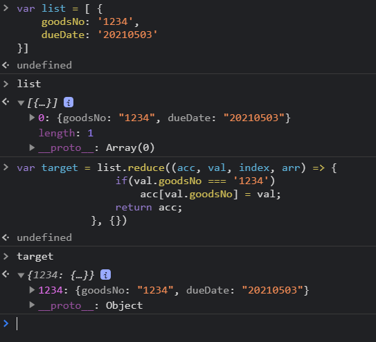

#### code 
```js
var list = [ {
    goodsNo: '1234',
    dueDate: '20210503'
},
 {
  ...
  },
  ...
  ]
  
  var target = list.reduce((acc, val, index, arr) => {    
                if(val.goodsNo === '1234')
                    acc[val.goodsNo] = val;
                return acc;
            }, {})
           
  console.log(target)
 ```
 
#### console result
 
 
#### 설명
